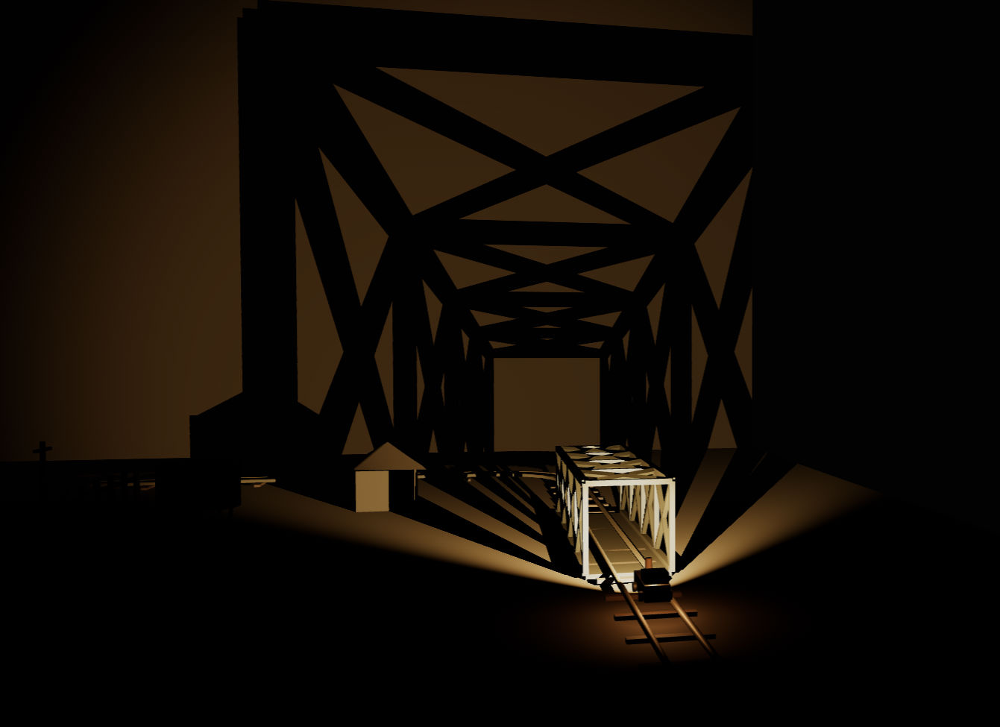

# Train of Life



**Train of Life** is an open-source 3D recreation of a light-and-shadow installation encountered in Echigo, Japan. It is evolving into a reusable Three.js/TypeScript framework for real-time "shadow theatre" scenes: physically scaled rooms, moving light sources, and silhouette projection onto walls.

It serves two gaps in the ecosystem:
1. **Digital preservation** of ephemeral installation art.
2. A **well-documented reference** for real-time shadow techniques in WebGL, which are scarce today.

---

## Vision

Train of Life starts as a recreation of one installation, but the goal is a small open toolkit for browser-based shadow-theatre art: dark rooms, moving light sources, and silhouettes cast on walls. Anyone should be able to preserve an installation they've seen — or invent a new one — with a few dozen lines of scene description.

## Reference Scene Concept

The core reference scene simulates the experience of standing inside a dark room beside a miniature electric train installation:

- **Physical Scale:** Uses real-world proportions where 1 unit = 1 meter. The room is 3 meters high, and the track is a rounded rectangular loop of approximately 2 meters by 4 meters.
- **Locomotive & Light Rig:** The locomotive is 5 centimeters high. It carries a strong forward-facing headlamp with a wide beam spread (>60°). 
- **Shadow Projection:** The room remains dark, with the primary visual effect being the train's moving headlamp casting sharp, dynamic silhouettes of nearby objects (such as the bridge's cross-frame structure and trees) onto the surrounding walls.
- **Environment Details:** Includes countryside-inspired elements scaled relative to the train: a nail-like forest, a round barn with a conical roof, a steel cross-frame bridge, farmhouses, water towers, and utility poles.

## Roadmap

- [x] Core scene: looped track, headlamp locomotive, silhouette-casting objects
- [ ] Extract reusable modules: TrackLoop, LightRig, procedural object library
- [ ] Scene authoring API — define a room + route + objects declaratively
- [ ] Shadow rendering performance on mobile / integrated GPUs
- [ ] WebXR mode (stand inside the room in VR)
- [ ] Documentation site with lighting-technique write-ups
- [ ] Community gallery of contributed scenes

## Development

To set up the project locally, install the dependencies and start the local development server:

```sh
npm install
npm run dev
```

### Verification & Build

To verify code correctness or build the project for production:

```sh
# Run TypeScript compilation check
npm run typecheck

# Build the production bundle
npm run build
```

## Contributing

Issues and PRs welcome — especially around shadow quality, performance, and new procedural objects. See open issues for good first tasks.

## License

This project is licensed under the MIT License - see the [LICENSE](./LICENSE) file for details.
